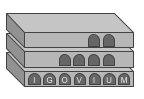

# [IgoVIUM](https://en.wikipedia.org/wiki/Iguvine_Tablets)



Multi-level caching service in Go.

Specifically: 
* [Distributed in-memory cache (L1)](cache/dm_cache_mapper.go)
* [DB-based cache (L2)](cache/db_cache.go)
* [Long term historization on persistent volumes (L3)](cache/historicizer.go)
  
Uses the following libraries:
* L1 - distributed in-memory cache
  * [Olric](https://github.com/buraksezer/olric)
  * [Redis](https://github.com/go-redis/redis)
* L2 - DB-based cache
  * [XORM](https://gitea.com/xorm/xorm) as ORM in Go targeting multiple DBs
* L3 - Historization to local and remote path

Historicizes to external volumes with any of the following formats:
* [CSV](cache/csv_formatter.go)
* [Parquet](cache/parquet_formatter.go)


## Example

### Start individual services

You can start a postgres DB with:
```
docker run --rm --name some-postgres -e POSTGRES_PASSWORD=secret -e POSTGRES_USER=user -e POSTGRES_DB=cache -p 5432:5432 -d postgres
```

and similarly a Redis instance:
```
docker run --rm --name some-redis -p 6379:6379 -d redis
```

However, you can directly use our `docker-compose.yaml` file:
```
docker-compose build
docker-compose up -d
```

### Example configuration (REST+gRPC server)

```yaml
rest:
  port: 9988
grpc:
  port: 50051
dm-cache:
  #type: olric
  #mode: lan
  type: redis
  host-address: 127.0.0.1:6379
  password: ""
db-cache:
  driver-name: postgres
  data-source-name: "host=localhost port=5432 user=user password=secret dbname=user sslmode=disable"
  local-cache-size: 0
  historicize:
    # example: run every 1 min - see https://crontab.guru/#*_*_*_*_*
    schedule: "* * * * *"
    #format: csv
    format: parquet
    tmp-dir: "./"
    date-partitioner: "year=2006/month=01/day=02"
    delete-local: true
    s3:
      endpoint: "play.min.io"
      use-ssl: false
      bucket: mytestbucket
      access-key-varname: ACCESSKEY
      secret-key-varname: SECRETKEY
```

with the date partitioner format `year=2006/month=01/day=02` referring to the Golang's year, month, day format as also described [here](https://stackoverflow.com/questions/20234104/how-to-format-current-time-using-a-yyyymmddhhmmss-format).

The `delete-local: bool` defines whether to remove local partitions upon file upload.

### Run the service

```bash
❯ ./igovium --config conf.yaml
```

### REST API example

PUT on `http://localhost:9988`:
```json
{
    "key":"mykey",
    "value": {"myvalue":1, "myotherval":100},
    "ttl" : "1h"
}
```

Returns 200 OK and the json payload.

GET on `http://localhost:9988/mykey`:
```json
{
    "myvalue": 1,
    "myotherval": 100
}
```

### Run the grpc client example
Please find an example gRPC client [here](examples/grpc_client/client.go).

```bash
❯ ./examples/grpc_client/grpc_client
2021/08/27 16:26:46 putting: k='key', v='{"mykey":"this-is-my-test-value"}'
2021/08/27 16:26:46 put response: res='', err='<nil>'
2021/08/27 16:26:46 get response: value:"{\"mykey\":\"this-is-my-test-value\"}"
```

### Historicizer example using play.minio S3
Here the `conf.yaml` settings:
```yaml
db-cache:
  historicize:
    s3:
      endpoint: "play.min.io"
      use-ssl: false
      bucket: mytestbucket
      access-key-varname: ACCESSKEY
      secret-key-varname: SECRETKEY
```

Here the actual variable containing the access key and secret key:
```bash
export ACCESSKEY=Q3AM3UQ867SPQQA43P2F
export SECRETKEY=zuf+tfteSlswRu7BJ86wekitnifILbZam1KYY3TG
```

## Running on K8s

Running igovium on K8s is as easy as defining a deployment. 

### DM-based cache

#### Olric-based DM cache

To run on Kubernetes, [olric-cloud-plugin](https://github.com/buraksezer/olric-cloud-plugin) and [hashicorp/go-discover](https://github.com/hashicorp/go-discover) are used.

A label of kind `run: olricd` is used to mark pods running olric-based processes. This can be configured directly in the dm-cache struct with the field value `k8s-discovery: 'label_selector="run = olricd"'`.
Specifically, to be able to discover pods running the service, a new role is created:

```yaml
apiVersion: rbac.authorization.k8s.io/v1
kind: Role
metadata:
  name: olricd
rules:
- apiGroups: [""]
  resources: ["pods"]
  verbs: ["get", "watch", "list"]
```

A new service account is then created and binded to the role:

```yaml
apiVersion: v1
kind: ServiceAccount
metadata:
  name: igovium
```

```yaml
kind: RoleBinding
apiVersion: rbac.authorization.k8s.io/v1
metadata:
  name: olricd
subjects:
- kind: ServiceAccount
  name: igovium
roleRef:
  kind: Role
  name: olricd
  apiGroup: rbac.authorization.k8s.io
```

In addition, a service is exposed for both `olricd` and `memberlist`:

```yaml
apiVersion: v1
kind: Service
metadata:
  name: memberlist
spec:
  selector:
    run: olricd
  clusterIP: None
  ports:
  - port: 3322
    protocol: TCP
    targetPort: 3322
---
apiVersion: v1
kind: Service
metadata:
  name: olricd
spec:
  selector:
    run: olricd
  ports:
  - port: 3320
    protocol: TCP
    targetPort: 3320
```

### DB-based cache

To quickly setup a postgres the [`bitnami/postgres`](https://bitnami.com/stack/postgresql/helm) Helm chart is used.

```bash
helm install db \
--set postgresqlUsername=user,postgresqlPassword=secret,postgresqlDatabase=cache \
bitnami/postgresql
```

Default values are specified [here](https://github.com/bitnami/charts/blob/master/bitnami/postgresql/values.yaml).
As visible, unless overridden, the default credentials are `postgres` and `secret` but we are changing them to those previously used in the `docker-compose.yaml` file.

### Deploying the Igovium service

```yaml
apiVersion: apps/v1
kind: Deployment
metadata:
  labels:
    app: igovium
    service: olricd
  name: igovium
spec:
  replicas: 3
  selector:
    matchLabels:
      app: igovium
  strategy: {}
  template:
    metadata:
      labels:
        app: igovium
        run: olricd
    spec:
      serviceAccountName: igovium
      containers:
        - image: pilillo/igovium:v0.2
          name: igovium
          volumeMounts:
            - mountPath: /confs
              name: igovium-conf-volume
          ports:
            - name: olricd
              containerPort: 3320
            - name: memberlist
              containerPort: 3322
            - name: rest
              containerPort: 9988
            - name: grpc
              containerPort: 50051
          env:
            - name: IGOVIUM_CONFIG
              value: /confs/igovium-conf.yaml
          resources:
            limits:
              cpu: 500m
            requests:
              cpu: 200m
      volumes:
        - name: igovium-conf-volume
          configMap:
            defaultMode: 420
            name: igovium-conf
status: {}
```

We can then expose a service for igovium as follows:
```yaml
apiVersion: v1
kind: Service
metadata:
  labels:
    app: igovium
  name: igovium
spec:
  type: ClusterIP
  ports:
    - port: 9988
      targetPort: 9988
      protocol: TCP
      name: rest
    - port: 50051
      targetPort: 50051
      protocol: TCP
      name: grpc
  selector:
    app: igovium
```

The full deployment discussed in this example is available [here](deployment/olric/igovium-olric.yml).